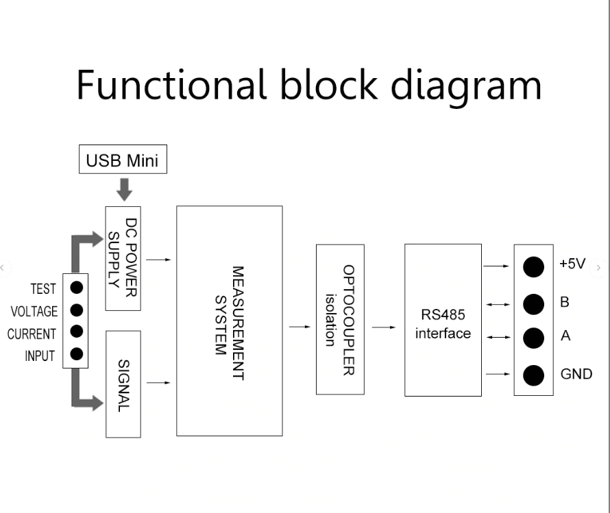
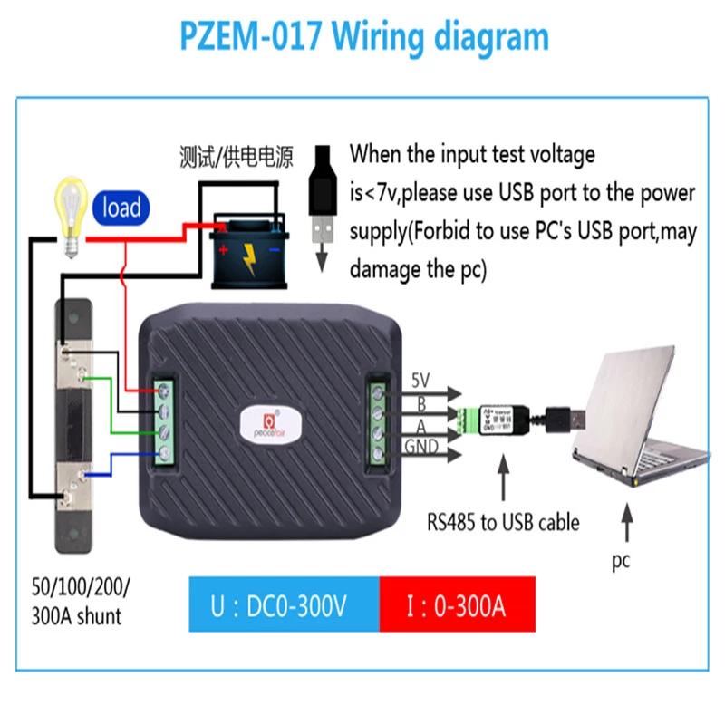

# Overview

This document describes the specificatin of the PZEM-017 DC communication module,
the module is mainly used for measuring DC voltage, current, active power, frequency
and energy consumption, the module is without display function, the data is read through
the RS485 interface.

    PZEM-017: Measuring Range 50A, 100A, 200A, 300A (the current range is depend on the external shunt specification)

## Function Description
1. **Voltage**
   - Measuring range: 0.05V - 300V. (When the source voltage is less
     than 7V, use external independent power supply)
   - Resolution: 0.01V
   - Measurement accuracy: 1%
2. **Current**
   - Measuring range: 0.02A - 300A (proper shunt must be used: FL-2 75mW
     {50A, 100A, 200A, 300A})
   - Resolution: 0.01A
   - Measurement accuracy: 1%
3. **Power**
   - Measuring range: 0.2kW - 90kW
   - Resolution: 0.01A
   - Measurement accuracy: 1%
4. **Energy** Consumption
   - Measuring range: 0-9999kWh
   - Resolution: 1Wh
   - Measuring accuracy: 1%
   - Reset energy: use software to reset
5. **Voltage** alarm
   - Low and High range can be set. When measured voltage is outside the
     range an alarm will be triggered.
   - Default Low threshold is 7V and high threshold is 300V
6. Communication interface
   - **RS485** interface

## Communication Protocol

1. Physical Layer protocol

    Physical layer use UART to RS485 communication interface.

    Baud rate is ***9600***, ***8*** data bits, ***2*** stop bits,
    ***No*** parity.

2. Application layer protocol

    The application layer uses the MODBUS-RTU protocol for
    communication. At present, it only support function codes such as
    ***0x03*** (Read Holding Register), ***0x04*** (Read Input Register)
    ***0x06*** (Write Single Register), ***0x41*** (Calibration)
    ***0x42*** (Reset energy),

    ***0x41*** function code is only for internal use (address can be
    only ***0xF8***), used for factory calibration and return to factory
    maintanace occasions, after the fuction code to increase 16-bit
    password, the default password is ***0x3721***

    The address range of the slave is ***0x01 ~ 0xF8***. The address
    ***0x00*** is used as the broadcast address, the slave does not need
    to reply the master. The address ***0xF8*** is used as general
    address, this address can be only used in a single slave environment
    and can be used for calibration etc.operation.

   1. Read the measurements

   The command format of the master read the measurement resut is (Total
   of 8 bytes)
   ```
   Slave Address + 0x04 + Register Address High Byte + Register Address 
   Low Byte + Number of Registers High Byte + Number of Registers Low Byte
   + CRC Check High Byte + CRC Check Low Byte 
   ```

   The command fromat of the reply from the slave is divided into two
   kinds:
   - Correct Reply:
   ```
   Slave Address: + 0x04 + Number of Bytes + Register 1 Data High Byte +
   Register 1 Data Low Byte + ... + CRC Check High Byte + CRC Check Low Byte 
   ```

   - Error Reply:
   ```
   Slave Address: + 0x84 + Abnormal code + CRC Check High Byte + CRC Check Low Byte 
   ```

   Abnormal code analyzed as following:
   +  0x01, Illegal function
   +  0x02, Illegal address
   +  0x03, Illegal data
   +  0x04, Slave error

    The register of the measurement results is arranges as the following
    table

    | Register address  | Description | Resolution |
    |---|---|---|
    |0x0000| Voltage value | 1LSB correspond to 0.01V|
    |0x0001| Current value | 1 LSB correspond to 0.01A|
    |0x0002| Power value low 16 bits| 1LSB correspond to 0.01W |
    |0x0003| Power value high 16 bits|
    |0x0004| Energy value low 16 bits| 1LSB correspond to 0.01Wh |
    |0x0005| Energy value high 16 bits|
    |0x0006| High voltage alarm status | ***0xFFFF*** is alarm, ***0x0000*** is not alarm|
    |0x0007| High voltage alarm status | ***0xFFFF*** is alarm, ***0x0000*** is not alarm|

   For example, the master sends the following command(CRC check code is replaced by 0xHH and 0xLL, the same below):
   ```hex
   0x01 0x04 0x00 0x00 0x00 0x08 0xHH 0xLL
   ```
   Indicated that the master needs to read 8 registers with slave address 0x01 and the start address of the register is 0x0000

   The correct reply from the slave is as following:
   ```hex
   0x01 0x04 0x10 0x27 0x10 0x00 0x64 0x03 0xE8 0x00 0x00 0x00 0x00 0x00 0x00 0x00 0x00 0x00 0x00 0xHH 0xLL
   ```

   The above data shows:
   + Voltage is 0x2710, converted to decimal is 10000, display 100.00V;
   + Current is 0x0064, converted to decimal is 100, display 1.00A;
   + Power is 0x000003E8, converted to decimal is 1000, display 100.0W;
   + Energy is 0x00000000, converted to decimal is 0, display 0Wh;
   + High voltage alarm status is 0x0000,indicates the current voltage is lower than the high voltage threshold.
   + Low voltage alarm status is 0x0000,indicates the current voltage is higher than the low voltage threshold.


   2. Read and modify device parameters

   At present, it only supports reading and modigying the slave address and power alarm threshold

   The register is arranged as the following table

    | Register address  | Description | Resolution |
    |---|---|---|
    |0x0000| High voltage alarm threshold (5V~350V), default is 300V | 1LSB correspond to 0.01V|
    |0x0001| Low voltage alarm threshold (1V~350V), default is 7V | 1LSB correspond to 0.01V|
    |0x0002| Modbus-RTU address| The range is ***0x0001~0x00F7***  |
    |0x0003| The current range (only for PZEM-017)| ***0x0000 : 100A*** <br/> ***0x0001 : 50A*** <br/> ***0x0002 : 200A*** <br/> ***0x0003 : 300A***

    The command format of the master to read the slave parameters and read the measurement results are same (described in details in Section 2.i)

    The command format of the master to modify the slave parameters is (total of 8 bytes):
    ```
    Slave Address + 0x06 + Register Address High Byte + Register Address 
    Low Byte + Register Value High Byte + Register Value Low Byte
    + CRC Check High Byte + CRC Check Low Byte 
    ```

    The command format of the reply from the slave is divided into two kinds:
    + Correct Reponse:
    ```
    Slave Address + 0x06 + Number of bytes + Register Address 
    Low Byte + Register Value High Byte + Register Value Low Byte
    + CRC Check High Byte + CRC Check Low Byte 
    ```
    + Error Reply:
    ```
    Slave Address: + 0x86 + Abnormal code + CRC Check High Byte + CRC Check Low Byte
    ```
    + For example
       * the master sets the slave's high voltage alarm threshold:
          ```
          0x01 0x06 0x00 0x00 0x4E 0x20 0xHH 0xLL 
          ```
          Indicates that the master needs to set the ***0x0000*** register (high voltage alarm threshold to ***0x4E20 (200.00V).  
          Set up correctly, the slave return to the data which is send from the master.

       * the master sets the slave's low voltage alarm threshold:
          ```
          0x01 0x06 0x00 0x01 0x03 0xE8 0xHH 0xLL 
          ```
          Indicates that the master needs to set the ***0x0001*** register (low voltage alarm threshold to ***0x03E8 (10.00V).  
          Set up correctly, the slave return to the data which is send from the master.

       * the master sets the address of the slave
          ```
          0x01 0x06 0x00 0x02 0x00 0x05 0xHH 0xLL   
          ```
         Indicated that the master needs to set the ***0x0002*** register (Modbus-RTU address) to 0x0005  
         Set up correctly, the slave return to the data which is sent from the master

   3. Reset energy

       The command fromat of the master to rest the slave's enery is (total 4 bytes):
       ```
       Slave address + 0x42 + CRC Check High Byte + CRC Check Low Byte      
       ```
       + Correct reply:
       ```
       slave address + 0x42 + CRC Check High Byte + CRC Check Low Byte
       ```
       + Error Reply:
       ```
       Slave address + 0xC2 + Abnormal code + CRC Check High Byte + CRC Check Low Byte
       ```

   4. Calibration

      The command format of the master to calibrate the slave is (total 6 bytes):
      ```
      0xF8 + 0x41 + 0x37 + 0x21 + CRC Check High Byte + CRC Check Low Byte
      ```
      + Correct reply
      ```
      0xF8 + 0x41 + 0x37 + 0x21 + CRC Check High Byte + CRC Check Low Byte
      ```
      + Error Reply:
      ```
      0xF8 + 0xC1 + Abnormal code + CRC Check High Byte + CRC Check Low Byte
      ```

      It should be noted that the calibration takes 3 to 3 seconds, after the master sends the commmand
      if the calibration is successful, it will take 3 ~ 4 seconda to receive responce from the slave.


   5. CRC check
       CRC check use 16bits format occupy two bytes, the generator polynomial is X16 + X15 + X2 + 1, the polynomial value used for calculation is 0xA001

## Functional Block Diagram



## Wiring Diagram



## Other Instructions

1. RS485 interface is passive output, need external connect 5V power supply and the the external power supply should > 100mA.

2. When the input test voltage is less than 7V, it must supply 5V independent work voltage through MICRO USB port;

**NOTE"** ***Do not use the USB port brind by your PC to be the independent power supply, otherwise it may damage your PC !***

3. Working temperature
   + -20℃~+60℃
